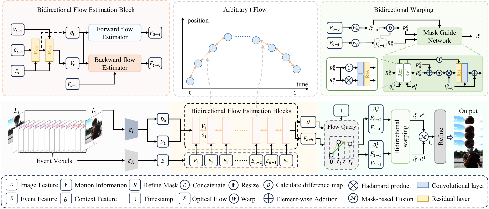

# One-Shot Flow, Any-Time Frame: A Bidirectional Warping Framework for Event-Based Video Frame Interpolation

This repository is the official implementation of [One-Shot Flow, Any-Time Frame](https://openaccess.thecvf.com/content/CVPR2026/html/Fu_One-Shot_Flow_Any-Time_Frame_A_Bidirectional_Warping_Framework_for_Event-Based_CVPR_2026_paper.html) (CVPR 2026 Highlight), an event-based video frame interpolation method.



## &#x1F4E6; Installation

```bash
conda create -n ofaf python=3.10
conda activate ofaf
pip install torch==2.9.1 torchvision==0.24.1 torchaudio==2.9.1 --index-url https://download.pytorch.org/whl/cu128
pip install opencv-contrib-python==4.11.0.86
pip install lpips==0.1.4
pip install tqdm==4.66.4
pip install cupy-cuda12x==13.3.0 -i https://pypi.org/simple/
pip install scikit-image==0.24.0
```

> The above is a quick-start script. For the full list of dependencies, see [requirements.txt](requirements.txt).

## &#x1F680; Getting Started

### &#x1F682; Training

Launch training with the provided script:

```bash
bash train_model.sh
```

Key arguments (edit inside `train_model.sh` or override via command line):

| Argument | Default | Description |
|----------|---------|-------------|
| `--epoch` | 20 | Number of training epochs |
| `--lr` | 2e-4 | Learning rate |
| `--dataset` | gopro | Dataset: gopro or ... |
| `--voxel_bins` | 128 | Event voxel bins |
| `--nb_of_flow` | 16 | Number of flow steps |
| `--batch_size` | 1 | Batch size per GPU |
| `--save_dir` | train | Checkpoint save directory |

Weights are saved to `train/{save_dir}/epoch{N}.pth`.

### &#x1F4C8; Evaluation

A reference evaluation script is provided in `bsergb_eval.py`:

```bash
python bsergb_eval.py --checkpoint train/bsergb.pth
```

| Argument | Default | Description |
|----------|---------|-------------|
| `--checkpoint` | train/bsergb.pth | Path to checkpoint |
| `--save_pred` | False | Save predicted frames |
| `--nb_of_flow` | 16 | Number of flow steps |
| `--voxel_bins` | 128 | Event voxel bins |

## &#x2B07; Pre-trained Weights

Download the pre-trained checkpoint from [GitHub Releases](https://github.com/Sudadaaaa/OF-AF/releases):

```bash
mkdir -p train
wget https://github.com/Sudadaaaa/OF-AF/releases/download/v1.0/bsergb.pth -O train/bsergb.pth
```

## &#x1F64F; Acknowledgements
This work builds upon several outstanding open-source projects:

- [softmax-splatting](https://github.com/sniklaus/softmax-splatting)
- [RAFT](https://github.com/princeton-vl/RAFT)
- [TimeLens-XL](https://github.com/OpenImagingLab/TimeLens-XL)
